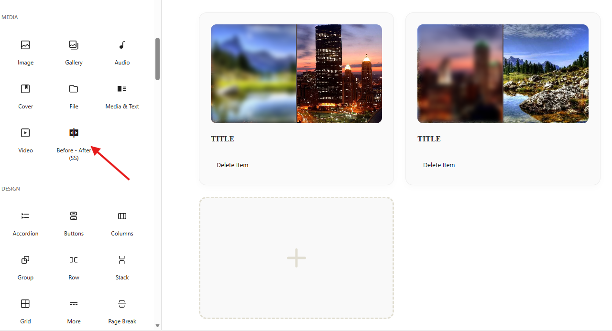

# SS Gutenberg Before After (Українська)

  

Сучасний блок Gutenberg для порівняння "До/Після". Ідеально підходить для портфоліо, тематичних досліджень та демонстрації результатів.

## Функції
- **Сітка (Grid)**: Відображення декількох порівнянь у зручній сітці.
- **Інтерактивний слайдер**: Плавна ручка для ручного порівняння.
- **Пагінація**: Підтримка великої кількості елементів зі зручною навігацією.
- **Повна адаптивність**: Працює на всіх розмірах екранів.
- **Легке налаштування**: Простий інтерфейс безпосередньо в редакторі WordPress.

## Скріншоти
### Адмінпанель (Редактор)

### Спереду (Frontend)

## Встановлення
1. Завантажте [останній реліз](https://sailstudio.com/wp-content/uploads/ss-before-after.zip).
2. Перейдіть до **Плагіни > Додати новий** в адміністративній панелі WordPress.
3. Натисніть **Завантажити плагін** і виберіть `.zip` файл.
4. Активуйте плагін.

## Розробник та Контакти
**SailStudio**  
Вебсайт: [sailstudio.com](https://sailstudio.com)

---
Створено з ❤️ від SailStudio.
